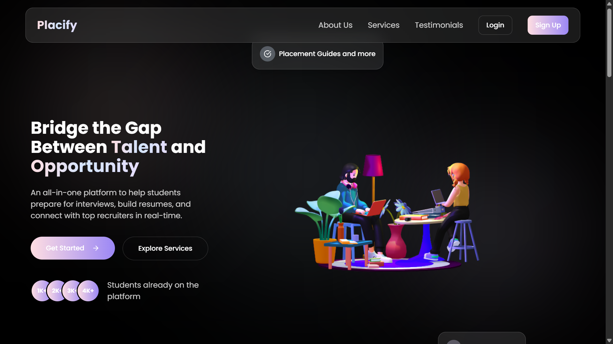
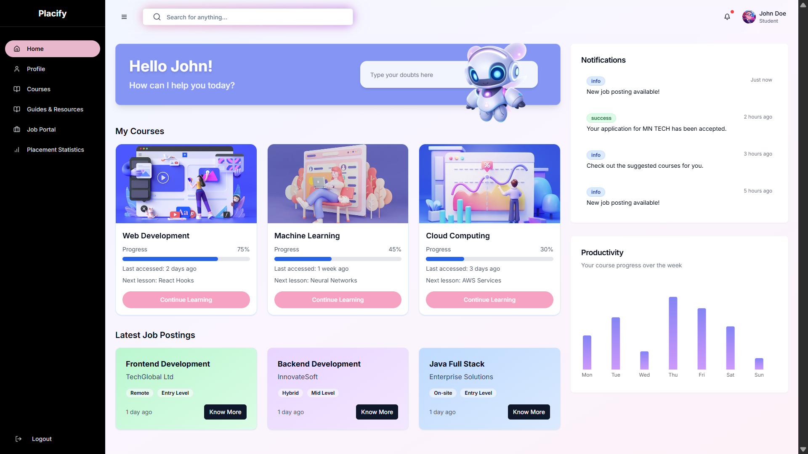
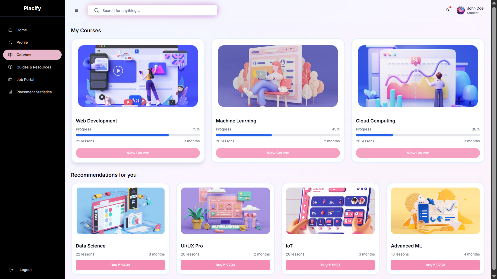
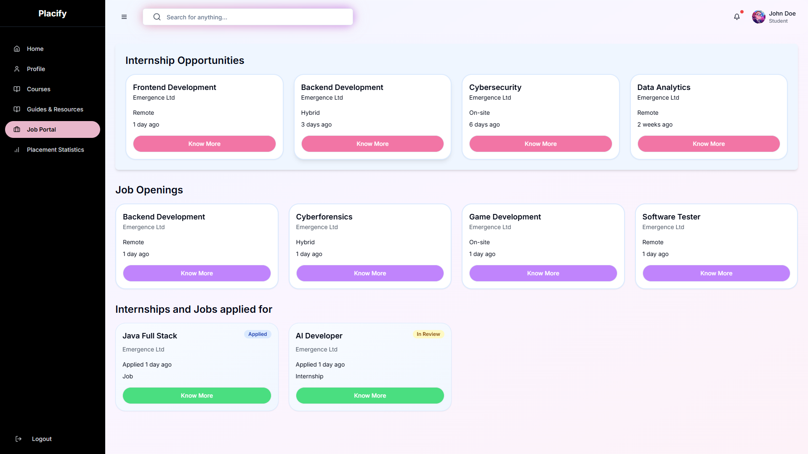
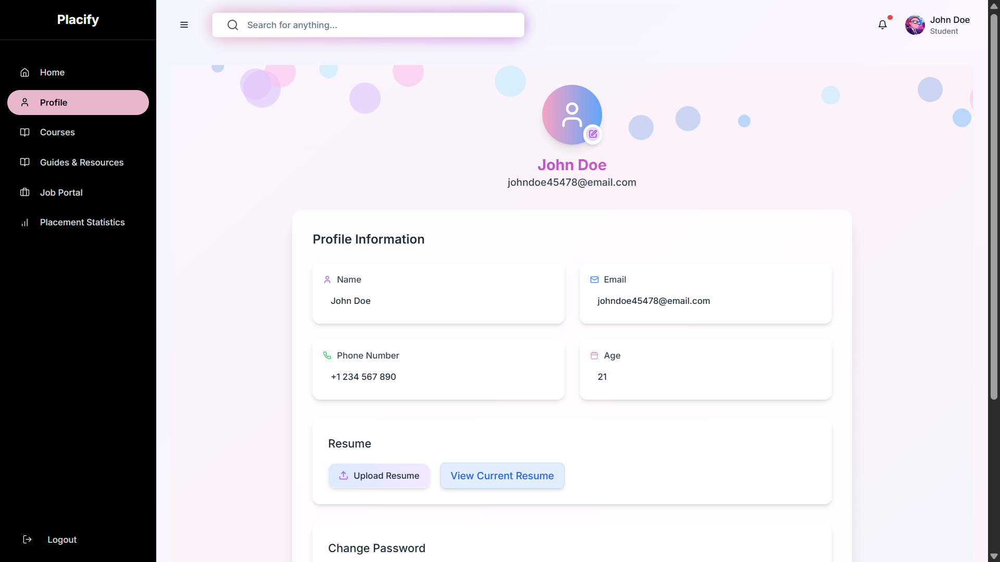
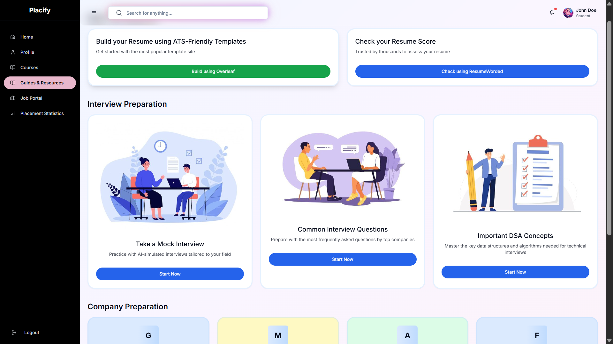
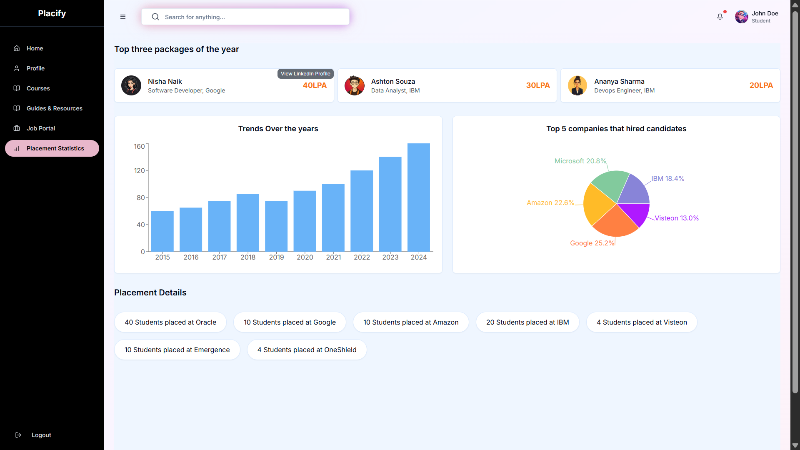

# Placify

### Empowering Career Growth & Placement Opportunities

Placify is an innovative platform designed to bridge the gap between education and employment by helping students upskill and find placement opportunities. With a focus on career development, Placify offers a range of features to enhance skills, connect with recruiters, and prepare for the professional world.

## Key Features:
- **Upskilling Resources**: Access courses, tutorials, and workshops to build the skills necessary for your career.
- **Job Listings & Placement Opportunities**: Discover job opportunities from various industries, with a direct connection to recruiters.
- **Profile Management**: Create and manage your professional profile to attract potential employers.
- **Application Support**: Apply for jobs seamlessly with an intuitive application process.

Placify is designed to help students navigate their career journey by providing all the tools and resources needed to succeed in the competitive job market.

## 📸 Screenshots
### 🌍 Landing

### 🏠 Home

### 📚 Courses

### 📋 Jobs

### 👤 Profile

### 📚 Resources

### 📊 Stats

